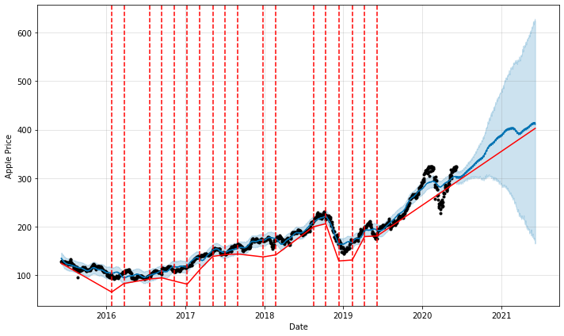
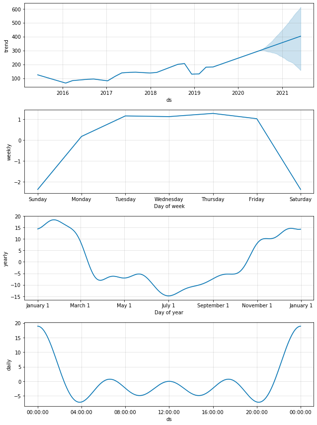
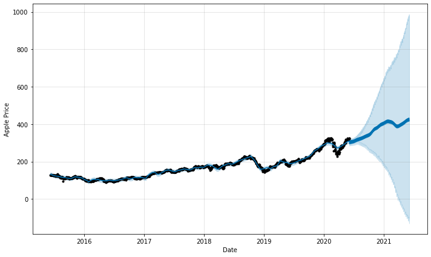

# Facebook Prophet Overview with Python

Forecasting has always been a challenging task. Trying to predict what the future will look like is hard however, it is very important for businesses to have an idea about what to expect. Knowing what to expect makes decision making a lot easier and creates sought of comfort and a sense of confidence.

In trying to help with this difficult task, a core of data Data Science team at Facebook created Prophet, a forecasting library for Python and R and made it open source in 2017.

Prophet has now become a tool used by data science experts and non-experts to make accurate forecasts. It has the capability to produce robust and scalable forecasts with very little manual effort. 

Prophet works best for time series analysis, it is built in Stan, which is a programming language for statistical inference written in C++.
it is also robust to missining values and handles outliers pretty well.
it provides room for domain knowledge to excel. 

### Prophet Forecasting Model

Generally, prophet decomposes a time series model in 3 moain components:
Trend
Seasonality
Holidays
and are combined mathematically as:

  y(t) = f(t) + s(t) + h(t) + $\epsilon$ t 

f(t) = Piecewise linear or logistic growth curve for non-periodic changes in time series

s(t) = Seasonal periodic changes

h(t) = holidays effects.

$\epsilon$ t = error term that accounts for unusual changes that are not reflected by the model.

### Steps in Using Prophet

1. Install all required packages
2. immport pandas, from fbprophet import prophet
3. get data from any source and convert to data frame using pandas
4. rename date column to 'ds' and convert it to datetime stamp and 'y' for values
5. instantiate prophet, fit the model and make your forecast


### Let's do the practicals


```python
#!pip install pystan
```


```python
#!pip install fbprophet
```


```python
#!pip install alpha-vantage
```


```python
# Importing all the neccessary libraries
import pandas as pd
from fbprophet import Prophet
import matplotlib.pyplot as plt
import numpy as np
%matplotlib inline
```


```python
# importing dataset 
apple = pd.read_csv(r"C:\Users\Ice Asortse\Facebook Prophet\AAPL.csv")
apple.head()
```


```python
# selectiong the columns of interest
apple = apple[['Date', 'Open']]
apple.head()
```


```python
#Covnvert the dataframe into the prophet expected format.
apple.columns = ['ds','y']
apple['ds'] = pd.to_datetime(apple['ds'])
```


```python
# Building the model
m = Prophet(changepoint_prior_scale=0.15, daily_seasonality=True)
m.fit(apple)
#making predictions
future = m.make_future_dataframe(periods=365, freq='D')
forecast = m.predict(future)
```


```python
forecast[['ds','yhat','yhat_lower','yhat_upper']].tail()
```


```python
#plotting with change points
from fbprophet.plot import add_changepoints_to_plot
fig = m.plot(forecast, xlabel = 'Date', ylabel = 'Apple Price')
a = add_changepoints_to_plot(fig.gca(),m,forecast)
```





```python
# Forecast components
m.plot_components(forecast)
```





```python
m = Prophet(changepoint_prior_scale=0.5)
forecast = m.fit(apple).predict(future)
fig = m.plot(forecast,xlabel = 'Date', ylabel = 'Apple Price')
```





```python

```
